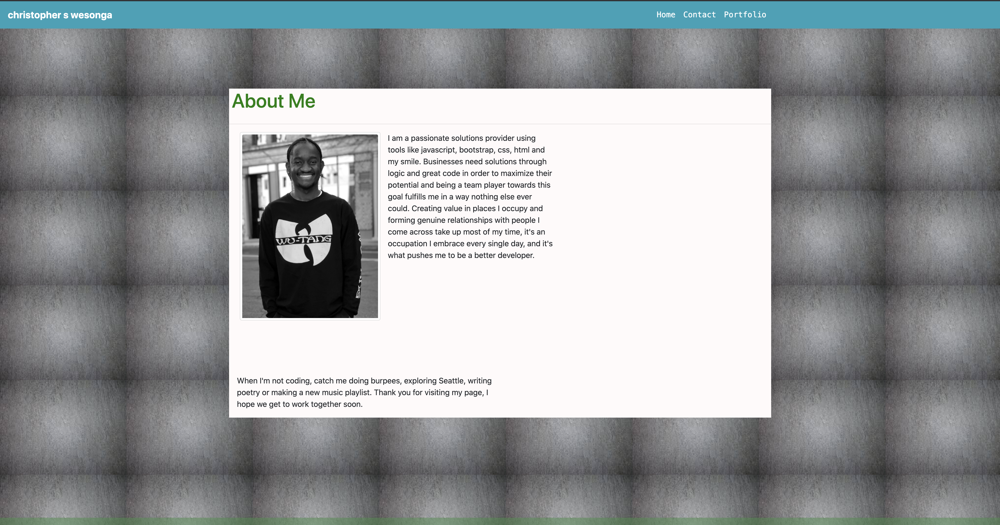

# first-draft-portfolio

**draft-1**
A sample README for my portfolio.

## Description
I have always wanted to provide solutions through logic and great code. This is my introduction to the industry, I am ready to learn and teach and be of value to businesses and individuals I come across. This webpage is my online office, feel free to visit any time and interact with me. 

## Technologies
-HTML
-BOOTSTRAP
-CSS

## Link to deployed website:
https://ckomodo.github.io/first-draft-portfolio/index.html

## Screenshot of Homepage

## Author Info
Feel free to contact and collaborate with me through the following platforms:
Twitter: @slimsakwa
Github: github.com/ckomodo